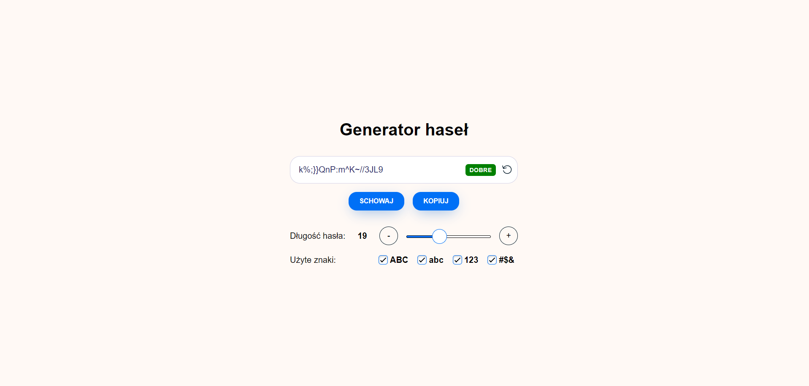

# Generator hasłą w React + (Module Sass)

## Jak pobrać:
Najpierw sklonuj projekt z github:

    git clone 'https://github.com/PanDamax01/react-Generator-Password'

Zainstaluj elementy projektu:

    npm i

Następnie projekt można odpalić, wykonując skrypt kompilacji za pośrednictwem npm:

    npm run dev

